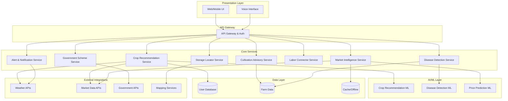

# Design Document: Farming Support Platform

## Overview

The Farming Support Platform is a comprehensive agricultural assistance system that guides farmers through the complete crop lifecycle. The platform architecture follows a modular, service-oriented design with clear separation between data collection, AI/ML processing, business logic, and presentation layers.

The system integrates multiple external data sources (weather services, market data, government databases) and provides intelligent recommendations through AI-based engines. The design prioritizes rural accessibility through multilingual support, voice interfaces, and offline capabilities.

### Key Design Principles

1. **Modularity**: Each feature (crop recommendation, disease detection, market intelligence) is implemented as an independent module with well-defined interfaces
2. **Data-Driven Intelligence**: AI/ML models are trained on regional agricultural data and continuously updated
3. **Accessibility-First**: Voice interfaces, simple UI, and offline support for low-connectivity environments
4. **Scalability**: Microservices architecture allows independent scaling of compute-intensive components
5. **Privacy**: User data is encrypted and access is strictly controlled

## Architecture

### High-Level Architecture



### Deployment Architecture

The platform uses a cloud-native microservices architecture:

- **API Gateway**: Handles authentication, rate limiting, and request routing
- **Service Layer**: Independent microservices for each major feature
- **ML Services**: GPU-enabled containers for image processing and ML inference
- **Data Stores**: PostgreSQL for relational data, MongoDB for unstructured data, Redis for caching
- **Message Queue**: RabbitMQ for asynchronous processing and alerts
- **CDN**: Content delivery for static assets and offline packages

## Components and Interfaces

### 1. Crop Recommendation Engine

**Purpose**: Analyzes locality, soil, weather, and market data to recommend optimal crops.

**Interfaces**:

```typescript
interface CropRecommendationRequest {
  farmerId: string;
  location: GeoLocation;
  soilType?: SoilType;
  farmSize: number;
  previousCrops?: string[];
  season: Season;
}

interface CropRecommendation {
  cropId: string;
  cropName: string;
  confidenceScore: number; // 0-1
  expectedYield: YieldEstimate;
  marketPrice: PriceRange;
  cultivationDifficulty: DifficultyLevel;
  waterRequirement: WaterRequirement;
  profitPotential: number;
  riskFactors: RiskFactor[];
}

interface CropRecommendationResponse {
  recommendations: CropRecommendation[];
  dataQuality: DataQualityMetrics;
  warnings: string[];
}
```

**Key Operations**:
- `getRecommendations(request: CropRecommendationRequest): CropRecommendationResponse`
- `fetchSoilData(location: GeoLocation): SoilData`
- `fetchWeatherForecast(location: GeoLocation, duration: number): WeatherForecast`
- `fetchMarketDemand(crops: string[], region: string): MarketDemand[]`

**ML Model**: Gradient boosting model trained on historical crop success data, considering:
- Soil pH, nutrients, texture
- Temperature, rainfall patterns
- Historical yields in the region
- Current market prices and trends

### 2. Cultivation Advisory Service

**Purpose**: Provides stage-wise cultivation guidance tailored to crop and location.

**Interfaces**:

```typescript
interface CultivationPlan {
  cropId: string;
  location: GeoLocation;
  plantingDate: Date;
  stages: CropStage[];
  totalDuration: number; // days
}

interface CropStage {
  stageId: string;
  stageName: string;
  startDay: number;
  duration: number;
  tasks: Task[];
  inputs: Input[];
  expectedConditions: Conditions;
}

interface Task {
  taskId: string;
  description: string;
  timing: string;
  priority: Priority;
  instructions: string[];
}

interface Input {
  inputType: InputType; // fertilizer, pesticide, water
  name: string;
  quantity: number;
  unit: string;
  applicationMethod: string;
  timing: string;
}
```

**Key Operations**:
- `createCultivationPlan(cropId: string, location: GeoLocation, plantingDate: Date): CultivationPlan`
- `getCurrentStage(planId: string): CropStage`
- `markStageComplete(planId: string, stageId: string): void`
- `adjustPlanForWeather(planId: string, weatherUpdate: WeatherData): CultivationPlan`

**Data Source**: Crop cultivation knowledge base with region-specific best practices.

### 3. Disease Detection Service

**Purpose**: Identifies crop diseases from images or symptom descriptions.

**Interfaces**:

```typescript
interface DiseaseDetectionRequest {
  farmerId: string;
  cropId: string;
  image?: ImageData;
  symptoms?: SymptomDescription[];
  location: GeoLocation;
}

interface DiseaseReport {
  detections: DiseaseDetection[];
  confidence: number;
  severity: SeverityLevel;
  recommendations: Treatment[];
  yieldImpact: YieldImpact;
}

interface DiseaseDetection {
  diseaseId: string;
  diseaseName: string;
  probability: number;
  affectedArea: number; // percentage
  stage: DiseaseStage;
}

interface Treatment {
  treatmentId: string;
  type: TreatmentType; // organic, chemical, cultural
  products: Product[];
  applicationInstructions: string[];
  cost: number;
  effectiveness: number;
  timeToRecovery: number; // days
}
```

**Key Operations**:
- `detectDiseaseFromImage(image: ImageData, cropId: string): DiseaseReport`
- `detectDiseaseFromSymptoms(symptoms: SymptomDescription[], cropId: string): DiseaseReport`
- `getTreatmentRecommendations(diseaseId: string, severity: SeverityLevel): Treatment[]`

**ML Model**: Convolutional Neural Network (CNN) trained on crop disease images:
- Architecture: ResNet-50 or EfficientNet
- Input: 224x224 RGB images
- Output: Disease classification with confidence scores
- Training data: Labeled images of healthy and diseased crops

### 4. Storage Locator Service

**Purpose**: Identifies nearby storage facilities and provides post-harvest guidance.

**Interfaces**:

```typescript
interface StorageSearchRequest {
  location: GeoLocation;
  radius: number; // km
  cropId: string;
  quantity: number;
  duration: number; // days
}

interface StorageFacility {
  facilityId: string;
  name: string;
  type: StorageType; // warehouse, cold storage, silo
  location: GeoLocation;
  distance: number;
  capacity: number;
  availableCapacity: number;
  costPerUnit: number;
  facilities: string[]; // cleaning, grading, packaging
  rating: number;
  contact: ContactInfo;
}

interface PostHarvestGuidance {
  cropId: string;
  optimalConditions: StorageConditions;
  preparationSteps: string[];
  maxStorageDuration: number;
  qualityChecks: QualityCheck[];
}

interface StorageConditions {
  temperature: TemperatureRange;
  humidity: HumidityRange;
  ventilation: string;
  pestControl: string[];
}
```

**Key Operations**:
- `findStorageFacilities(request: StorageSearchRequest): StorageFacility[]`
- `getPostHarvestGuidance(cropId: string): PostHarvestGuidance`
- `reserveStorage(facilityId: string, quantity: number, duration: number): Reservation`

### 5. Market Intelligence Service

**Purpose**: Analyzes market trends and provides selling recommendations.

**Interfaces**:

```typescript
interface MarketIntelligenceRequest {
  cropId: string;
  location: GeoLocation;
  quantity: number;
  quality: QualityGrade;
}

interface MarketIntelligence {
  currentPrices: MarketPrice[];
  priceHistory: PriceHistory;
  priceForecast: PriceForecast;
  sellingRecommendation: SellingRecommendation;
  buyers: BuyerListing[];
}

interface MarketPrice {
  marketId: string;
  marketName: string;
  location: GeoLocation;
  price: number;
  currency: string;
  date: Date;
  volume: number;
}

interface PriceForecast {
  predictions: PricePrediction[];
  confidence: number;
  factors: PriceInfluencingFactor[];
}

interface SellingRecommendation {
  optimalTiming: DateRange;
  recommendedChannels: SellingChannel[];
  expectedPrice: PriceRange;
  reasoning: string[];
}

interface SellingChannel {
  channelType: ChannelType; // local market, mandi, direct buyer, online
  name: string;
  expectedPrice: number;
  paymentTerms: string;
  logistics: LogisticsInfo;
  pros: string[];
  cons: string[];
}
```

**Key Operations**:
- `getMarketIntelligence(request: MarketIntelligenceRequest): MarketIntelligence`
- `comparePrices(cropId: string, markets: string[]): PriceComparison`
- `evaluateOffer(cropId: string, offeredPrice: number, quantity: number): OfferEvaluation`
- `listCropForSale(listing: CropListing): ListingConfirmation`

**ML Model**: Time series forecasting for price prediction:
- LSTM or Prophet model
- Features: Historical prices, seasonal patterns, weather, production estimates
- Output: Price predictions with confidence intervals

### 6. Labor Connector Service

**Purpose**: Connects farmers with skilled agricultural workers.

**Interfaces**:

```typescript
interface LaborSearchRequest {
  location: GeoLocation;
  radius: number;
  skills: Skill[];
  startDate: Date;
  duration: number; // days
  numberOfWorkers: number;
}

interface LaborProfile {
  workerId: string;
  name: string;
  location: GeoLocation;
  skills: Skill[];
  experience: number; // years
  availability: Availability[];
  wageExpectation: WageInfo;
  rating: number;
  completedJobs: number;
  languages: string[];
}

interface LaborEngagement {
  engagementId: string;
  farmerId: string;
  workerId: string;
  task: string;
  startDate: Date;
  duration: number;
  agreedWage: number;
  status: EngagementStatus;
}
```

**Key Operations**:
- `searchLabor(request: LaborSearchRequest): LaborProfile[]`
- `createEngagement(farmerId: string, workerId: string, details: EngagementDetails): LaborEngagement`
- `rateWorker(engagementId: string, rating: number, feedback: string): void`
- `notifyWorkersOfOpportunity(location: GeoLocation, task: string): void`

### 7. Government Scheme Assistant

**Purpose**: Identifies eligible government schemes and assists with applications.

**Interfaces**:

```typescript
interface FarmerProfile {
  farmerId: string;
  location: GeoLocation;
  landSize: number;
  landOwnership: OwnershipType;
  crops: string[];
  income: IncomeRange;
  category: FarmerCategory; // small, marginal, large
  demographics: Demographics;
}

interface GovernmentScheme {
  schemeId: string;
  name: string;
  description: string;
  benefits: Benefit[];
  eligibilityCriteria: Criterion[];
  applicationDeadline?: Date;
  applicationProcess: ApplicationStep[];
  requiredDocuments: Document[];
  contactInfo: ContactInfo;
}

interface EligibilityCheck {
  schemeId: string;
  isEligible: boolean;
  matchedCriteria: Criterion[];
  unmatchedCriteria: Criterion[];
  recommendations: string[];
}

interface SchemeApplication {
  applicationId: string;
  farmerId: string;
  schemeId: string;
  status: ApplicationStatus;
  submittedDate: Date;
  documents: UploadedDocument[];
  statusHistory: StatusUpdate[];
}
```

**Key Operations**:
- `findEligibleSchemes(profile: FarmerProfile): GovernmentScheme[]`
- `checkEligibility(farmerId: string, schemeId: string): EligibilityCheck`
- `getApplicationGuidance(schemeId: string): ApplicationGuidance`
- `submitApplication(application: SchemeApplication): ApplicationConfirmation`
- `trackApplicationStatus(applicationId: string): ApplicationStatus`

### 8. Alert and Notification Service

**Purpose**: Delivers timely, relevant alerts about weather, policy, market, and pest conditions.

**Interfaces**:

```typescript
interface Alert {
  alertId: string;
  type: AlertType; // weather, policy, market, pest, general
  severity: Severity; // critical, high, medium, low
  title: string;
  message: string;
  actionableSteps: string[];
  relevantTo: AlertTarget;
  expiresAt: Date;
  createdAt: Date;
}

interface AlertTarget {
  locations: GeoLocation[];
  crops: string[];
  farmerCategories: FarmerCategory[];
}

interface AlertPreferences {
  farmerId: string;
  enabledTypes: AlertType[];
  deliveryChannels: DeliveryChannel[]; // push, sms, voice
  quietHours: TimeRange;
  language: string;
}
```

**Key Operations**:
- `createAlert(alert: Alert): void`
- `sendAlert(alertId: string, recipients: string[]): void`
- `getAlertsForFarmer(farmerId: string): Alert[]`
- `updateAlertPreferences(preferences: AlertPreferences): void`
- `acknowledgeAlert(farmerId: string, alertId: string): void`

**Alert Triggers**:
- Weather: Severe weather forecasts (storms, frost, heatwaves)
- Policy: New schemes, regulation changes
- Market: Significant price changes (>15% in 7 days)
- Pest: Outbreak reports within 50km radius

### 9. Voice Interface Service

**Purpose**: Provides speech-to-text and text-to-speech capabilities in multiple languages.

**Interfaces**:

```typescript
interface VoiceInput {
  audioData: AudioBuffer;
  language: string;
  context?: string; // helps with domain-specific recognition
}

interface VoiceOutput {
  text: string;
  confidence: number;
  alternatives?: string[];
}

interface SpeechRequest {
  text: string;
  language: string;
  voice: VoiceProfile;
  speed: number; // 0.5 - 2.0
}

interface SpeechResponse {
  audioData: AudioBuffer;
  duration: number;
}
```

**Key Operations**:
- `speechToText(input: VoiceInput): VoiceOutput`
- `textToSpeech(request: SpeechRequest): SpeechResponse`
- `getSupportedLanguages(): Language[]`

**Technology**: Integration with cloud speech services (Google Cloud Speech-to-Text, AWS Polly) with fallback to offline models for basic functionality.

### 10. Offline Sync Service

**Purpose**: Enables core functionality when internet connectivity is limited.

**Interfaces**:

```typescript
interface OfflinePackage {
  packageId: string;
  farmerId: string;
  crops: string[];
  cultivationGuides: CultivationPlan[];
  diseaseDatabase: DiseaseInfo[];
  lastUpdated: Date;
  expiresAt: Date;
}

interface SyncStatus {
  lastSyncTime: Date;
  pendingUploads: number;
  pendingDownloads: number;
  conflicts: DataConflict[];
}
```

**Key Operations**:
- `downloadOfflinePackage(farmerId: string): OfflinePackage`
- `syncData(farmerId: string): SyncStatus`
- `resolveConflict(conflict: DataConflict, resolution: Resolution): void`

**Offline Capabilities**:
- View cultivation plans and stage instructions
- Access disease identification guide (text-based)
- View cached market prices (with age indicator)
- Record observations and tasks (sync when online)

## Data Models

### Core Entities

```typescript
// Farmer
interface Farmer {
  farmerId: string;
  name: string;
  phone: string;
  email?: string;
  location: GeoLocation;
  language: string;
  farms: Farm[];
  preferences: UserPreferences;
  createdAt: Date;
}

// Farm
interface Farm {
  farmId: string;
  farmerId: string;
  location: GeoLocation;
  size: number; // hectares
  soilType: SoilType;
  irrigationType: IrrigationType;
  crops: CropCycle[];
}

// Crop Cycle
interface CropCycle {
  cycleId: string;
  farmId: string;
  cropId: string;
  plantingDate: Date;
  harvestDate?: Date;
  cultivationPlanId: string;
  status: CycleStatus;
  observations: Observation[];
  yieldActual?: number;
}

// Observation
interface Observation {
  observationId: string;
  cycleId: string;
  date: Date;
  type: ObservationType; // growth, disease, pest, weather
  description: string;
  images: string[];
  severity?: SeverityLevel;
}

// Geolocation
interface GeoLocation {
  latitude: number;
  longitude: number;
  address?: string;
  district: string;
  state: string;
  country: string;
}

// Soil Data
interface SoilData {
  soilType: SoilType;
  pH: number;
  nitrogen: NutrientLevel;
  phosphorus: NutrientLevel;
  potassium: NutrientLevel;
  organicMatter: number;
  texture: SoilTexture;
}

// Weather Data
interface WeatherData {
  location: GeoLocation;
  date: Date;
  temperature: TemperatureData;
  rainfall: number; // mm
  humidity: number; // percentage
  windSpeed: number; // km/h
  forecast: WeatherForecast[];
}

// Market Data
interface MarketData {
  cropId: string;
  marketId: string;
  date: Date;
  price: number;
  currency: string;
  volume: number;
  quality: QualityGrade;
}
```

### Enumerations

```typescript
enum SoilType {
  CLAY = "clay",
  SANDY = "sandy",
  LOAMY = "loamy",
  SILTY = "silty",
  PEATY = "peaty",
  CHALKY = "chalky"
}

enum Season {
  KHARIF = "kharif",      // monsoon season
  RABI = "rabi",          // winter season
  ZAID = "zaid",          // summer season
  PERENNIAL = "perennial"
}

enum DifficultyLevel {
  EASY = "easy",
  MODERATE = "moderate",
  DIFFICULT = "difficult"
}

enum SeverityLevel {
  LOW = "low",
  MEDIUM = "medium",
  HIGH = "high",
  CRITICAL = "critical"
}

enum AlertType {
  WEATHER = "weather",
  POLICY = "policy",
  MARKET = "market",
  PEST = "pest",
  DISEASE = "disease",
  GENERAL = "general"
}

enum CycleStatus {
  PLANNED = "planned",
  ACTIVE = "active",
  HARVESTED = "harvested",
  FAILED = "failed"
}
```

## Correctness Properties

*A property is a characteristic or behavior that should hold true across all valid executions of a system—essentially, a formal statement about what the system should do. Properties serve as the bridge between human-readable specifications and machine-verifiable correctness guarantees.*


### Crop Recommendation Properties

Property 1: Complete data collection for recommendations
*For any* crop recommendation request with valid locality data, the system SHALL fetch soil type, weather forecast, and market data before generating recommendations.
**Validates: Requirements 1.1, 1.2, 1.3**

Property 2: Recommendation completeness
*For any* generated crop recommendation, the output SHALL include a ranked list with confidence scores, and each recommendation SHALL contain expected yield, market price range, and cultivation difficulty.
**Validates: Requirements 1.4, 1.5**

Property 3: Invalid locality data handling
*For any* crop recommendation request with incomplete or invalid locality data, the system SHALL return an error response requesting additional information rather than generating recommendations.
**Validates: Requirements 1.6**

### Cultivation Guidance Properties

Property 4: Complete cultivation timeline generation
*For any* selected crop and location, the cultivation advisor SHALL generate a timeline containing all crop stages from planting to harvest.
**Validates: Requirements 2.1**

Property 5: Cultivation instruction completeness
*For any* crop stage, the provided instructions SHALL include tasks, inputs, timing, water requirements, fertilizer recommendations, and pest management guidance.
**Validates: Requirements 2.2, 2.3**

Property 6: Stage progression
*For any* cultivation plan, when a farmer marks a stage as complete, the system SHALL advance to the next stage and the current stage SHALL be the successor of the completed stage.
**Validates: Requirements 2.4**

Property 7: Weather-based plan adjustment
*For any* active cultivation plan, when weather conditions change significantly, the system SHALL generate adjusted recommendations and create a notification for the farmer.
**Validates: Requirements 2.5**

Property 8: Language localization
*For any* farmer with a selected language preference, all displayed cultivation instructions SHALL be in that language.
**Validates: Requirements 2.6**

### Disease Detection Properties

Property 9: Image analysis execution
*For any* uploaded crop image, the disease detector SHALL perform analysis and return a result (either disease detection or no disease found).
**Validates: Requirements 3.1**

Property 10: Disease report structure and treatment options
*For any* disease detection result, the disease report SHALL include disease name, severity, confidence level, and treatment recommendations SHALL include both organic and chemical options.
**Validates: Requirements 3.2, 3.3**

Property 11: Symptom-based detection
*For any* symptom description provided without an image, the disease detector SHALL attempt to identify potential diseases using symptom matching.
**Validates: Requirements 3.4**

Property 12: Disease ranking by probability
*For any* disease detection result with multiple possible diseases, the diseases SHALL be ordered by probability in descending order.
**Validates: Requirements 3.5**

Property 13: Yield impact estimation
*For any* detected disease, the system SHALL include an estimated yield impact value in the disease report.
**Validates: Requirements 3.6**

### Storage and Post-Harvest Properties

Property 14: Spatial search accuracy
*For any* storage facility search with a specified radius, all returned facilities SHALL be within that radius from the farmer's location.
**Validates: Requirements 4.1**

Property 15: Storage facility information completeness
*For any* displayed storage facility, the information SHALL include facility type, capacity, cost, and distance from the farmer's location.
**Validates: Requirements 4.2**

Property 16: Storage guidance completeness
*For any* crop selected for storage, the system SHALL provide storage conditions including temperature range, humidity range, and maximum duration, plus post-harvest steps including cleaning, drying, grading, and packaging.
**Validates: Requirements 4.3, 4.4**

Property 17: Storage reservation availability
*For any* storage facility with available capacity greater than zero, the system SHALL allow reservation creation for quantities up to the available capacity.
**Validates: Requirements 4.5**

Property 18: Storage duration alerts
*For any* stored crop, when the storage duration exceeds the recommended maximum duration for that crop, the system SHALL generate an alert about quality degradation.
**Validates: Requirements 4.6**

### Waste Recycling Properties

Property 19: Recycling option diversity
*For any* crop waste type, the system SHALL suggest at least two different recycling options from the set {composting, biogas, animal feed}.
**Validates: Requirements 5.1**

Property 20: Recycling option information completeness
*For any* displayed recycling option, the information SHALL include potential revenue, environmental benefits, and implementation steps.
**Validates: Requirements 5.2**

Property 21: Equipment facility identification
*For any* recycling method that requires equipment, the system SHALL identify and display nearby facilities or rental options.
**Validates: Requirements 5.3**

Property 22: Environmental impact tracking
*For any* implemented recycling practice, the system SHALL record and track environmental impact metrics.
**Validates: Requirements 5.4**

Property 23: Incentive information display
*For any* farmer location where government recycling incentives exist, the system SHALL display information about available programs.
**Validates: Requirements 5.5**

### Market Intelligence Properties

Property 24: Multi-market price display
*For any* crop, the market intelligence module SHALL display current prices from at least two different markets.
**Validates: Requirements 6.1**

Property 25: Historical price trends
*For any* displayed price data, the system SHALL include price trends for 30-day, 60-day, and 90-day periods.
**Validates: Requirements 6.2**

Property 26: Selling timing recommendations
*For any* selling request, the market intelligence module SHALL provide an optimal timing recommendation based on price forecasts.
**Validates: Requirements 6.3**

Property 27: Selling channel comparison
*For any* crop with multiple selling channels available, the system SHALL compare options including at least two channel types from {local markets, mandis, direct buyers, online platforms}.
**Validates: Requirements 6.4**

Property 28: Price offer evaluation
*For any* price offer received by a farmer, the system SHALL indicate whether the offer is fair, above market, or below market based on current market data.
**Validates: Requirements 6.5**

Property 29: High demand alerts
*For any* crop experiencing high demand (demand increase > 20%), the system SHALL send alerts to all farmers currently growing that crop.
**Validates: Requirements 6.6**

Property 30: Buyer connection
*For any* crop listing created by a farmer, the system SHALL attempt to match and connect with potential buyers.
**Validates: Requirements 6.7**

### Labor Connectivity Properties

Property 31: Labor profile completeness
*For any* labor search result, each displayed worker profile SHALL include skills, experience, availability, and wage expectations.
**Validates: Requirements 7.1, 7.2**

Property 32: Contact facilitation
*For any* worker selection by a farmer, the system SHALL create a contact mechanism between the farmer and worker.
**Validates: Requirements 7.3**

Property 33: Bidirectional rating capability
*For any* completed labor engagement, both the farmer and worker SHALL be able to provide ratings and feedback.
**Validates: Requirements 7.4**

Property 34: Preferred worker persistence
*For any* farmer, the system SHALL allow saving worker preferences, and saved workers SHALL be retrievable in future sessions.
**Validates: Requirements 7.5**

Property 35: Labor opportunity notifications
*For any* region with high labor demand, the system SHALL send notifications to available workers in that region.
**Validates: Requirements 7.6**

### Government Scheme Properties

Property 36: Eligibility matching
*For any* farmer profile, the scheme assistant SHALL identify all government schemes where the farmer meets the eligibility criteria.
**Validates: Requirements 8.1**

Property 37: Scheme information completeness
*For any* displayed government scheme, the information SHALL include scheme name, benefits, eligibility criteria, application deadlines, step-by-step guidance, and required documents.
**Validates: Requirements 8.2, 8.3, 8.4**

Property 38: New scheme notifications
*For any* newly announced government scheme, the system SHALL notify all farmers who meet the eligibility criteria.
**Validates: Requirements 8.5**

Property 39: Application status updates
*For any* scheme application with a status change, the system SHALL send an update notification to the farmer.
**Validates: Requirements 8.6**

Property 40: Scheme combination recommendations
*For any* farmer eligible for multiple schemes that can be combined, the system SHALL recommend optimal combinations.
**Validates: Requirements 8.7**

### Alert System Properties

Property 41: Severe weather alerts with actions
*For any* severe weather forecast in a farmer's locality, the system SHALL send an immediate alert that includes protective action recommendations.
**Validates: Requirements 9.1**

Property 42: Policy change notifications
*For any* policy change affecting a specific crop, the system SHALL notify all farmers growing that crop with details and implications.
**Validates: Requirements 9.2**

Property 43: Significant price change alerts
*For any* crop with a price change exceeding 15% in 7 days, the system SHALL alert all farmers growing that crop.
**Validates: Requirements 9.3**

Property 44: Proximity-based pest alerts
*For any* pest outbreak reported in a location, the system SHALL warn all farmers within 50km and provide preventive measures.
**Validates: Requirements 9.4**

Property 45: Alert prioritization
*For any* farmer with multiple pending alerts, the alerts SHALL be ordered by severity (critical > high > medium > low) and then by relevance.
**Validates: Requirements 9.5**

Property 46: Alert preference enforcement with safety override
*For any* farmer with disabled alert types, the system SHALL not send alerts of those types UNLESS the alert is marked as critical safety alert.
**Validates: Requirements 9.7**

### Multilingual Interface Properties

Property 47: Complete content localization
*For any* selected language, all text content displayed to the farmer SHALL be in that language.
**Validates: Requirements 10.2**

Property 48: Voice-to-text conversion
*For any* voice input in a supported language, the voice interface SHALL convert the speech to text in that language.
**Validates: Requirements 10.3**

Property 49: Text-to-speech availability
*For any* information displayed to a farmer, the system SHALL offer a text-to-speech option in the farmer's selected language.
**Validates: Requirements 10.4**

Property 50: Voice recognition error handling
*For any* voice input that fails recognition, the system SHALL prompt the farmer to repeat or rephrase.
**Validates: Requirements 10.5**

Property 51: Offline data access
*For any* farmer with previously downloaded cultivation guides, when internet connectivity is unavailable, the system SHALL provide access to the cached guides.
**Validates: Requirements 10.7**

Property 52: Language switch data preservation
*For any* farmer who switches their language preference, all their farm data, cultivation plans, and preferences SHALL remain unchanged.
**Validates: Requirements 10.8**

### Data Privacy and Security Properties

Property 53: Data encryption on account creation
*For any* newly created farmer account, all personal and farm data SHALL be encrypted before storage.
**Validates: Requirements 11.1**

Property 54: Consent requirement for data sharing
*For any* third-party data request, the system SHALL require and obtain explicit farmer consent before sharing any data.
**Validates: Requirements 11.3**

Property 55: Data export fulfillment
*For any* farmer data export request, the system SHALL generate a complete data export within 48 hours.
**Validates: Requirements 11.4**

Property 56: Data deletion fulfillment
*For any* farmer data deletion request, the system SHALL permanently remove all personal data within 30 days.
**Validates: Requirements 11.5**

Property 57: Suspicious activity response
*For any* detected suspicious account activity, the system SHALL send an alert to the farmer and temporarily restrict account access.
**Validates: Requirements 11.7**

### System Integration Properties

Property 58: Weather data integration
*For any* request requiring weather data, the system SHALL fetch data from meteorological services.
**Validates: Requirements 12.1**

Property 59: Market data integration
*For any* request requiring market data, the system SHALL retrieve current prices from market boards and trading platforms.
**Validates: Requirements 12.2**

Property 60: External data synchronization timing
*For any* external data source update, the system SHALL synchronize the data within 1 hour.
**Validates: Requirements 12.3**

Property 61: Fallback to cached data with notification
*For any* external data source that is unavailable, the system SHALL use cached data and display the data age to users.
**Validates: Requirements 12.4**

Property 62: Secure government API connections
*For any* government database API call, the system SHALL use secure protocols (HTTPS with TLS 1.2+).
**Validates: Requirements 12.5**

Property 63: Data conflict resolution and logging
*For any* data conflict between sources, the system SHALL apply conflict resolution rules and log the discrepancy.
**Validates: Requirements 12.6**

Property 64: Offline critical feature availability
*For any* critical feature {crop cultivation plans, disease identification guide, cached market prices}, when the platform is offline, the feature SHALL remain functional using locally cached data.
**Validates: Requirements 12.7**

## Error Handling

### Error Categories

1. **Input Validation Errors**
   - Invalid location coordinates
   - Missing required fields
   - Invalid data formats
   - Out-of-range values

2. **External Service Errors**
   - Weather API unavailable
   - Market data service timeout
   - Government database connection failure
   - Map service errors

3. **ML Model Errors**
   - Low confidence predictions
   - Image processing failures
   - Model inference timeout
   - Invalid input format for ML models

4. **Data Errors**
   - Database connection failures
   - Data inconsistencies
   - Cache misses
   - Synchronization conflicts

5. **Authentication and Authorization Errors**
   - Invalid credentials
   - Expired sessions
   - Insufficient permissions
   - Suspicious activity detected

### Error Handling Strategies

**Graceful Degradation**:
- When external services fail, use cached data with age indicators
- When ML models have low confidence, provide alternative symptom-based matching
- When real-time data is unavailable, use historical averages with warnings

**User-Friendly Error Messages**:
- Translate all error messages to the user's selected language
- Provide actionable next steps for recoverable errors
- Use simple, non-technical language
- Include support contact information for critical errors

**Retry Logic**:
- Exponential backoff for transient failures (network timeouts, rate limits)
- Maximum 3 retry attempts for external API calls
- Circuit breaker pattern for consistently failing services

**Logging and Monitoring**:
- Log all errors with context (user ID, request parameters, timestamp)
- Alert on-call engineers for critical system failures
- Track error rates and patterns for proactive issue detection

**Fallback Mechanisms**:
- Offline mode for core features when network is unavailable
- Alternative data sources when primary sources fail
- Manual expert consultation recommendations when automated systems fail

## Testing Strategy

### Dual Testing Approach

The platform requires both unit testing and property-based testing for comprehensive coverage:

**Unit Tests**: Focus on specific examples, edge cases, and integration points
- Specific crop recommendation scenarios
- Known disease images with expected diagnoses
- Edge cases like empty inputs, boundary values
- Integration between services
- Error conditions and fallback behaviors

**Property-Based Tests**: Verify universal properties across all inputs
- Each correctness property listed above must be implemented as a property-based test
- Minimum 100 iterations per property test to ensure comprehensive input coverage
- Random generation of farmers, locations, crops, dates, and other domain entities

### Property-Based Testing Configuration

**Testing Library**: Use appropriate PBT library for the implementation language:
- Python: Hypothesis
- TypeScript/JavaScript: fast-check
- Java: jqwik
- Go: gopter

**Test Configuration**:
- Minimum 100 test cases per property
- Seed-based reproducibility for failed tests
- Shrinking enabled to find minimal failing examples

**Test Tagging**: Each property test must reference its design property:
```
Feature: farming-support-platform, Property 1: Complete data collection for recommendations
Feature: farming-support-platform, Property 2: Recommendation completeness
...
```

### Test Data Generation

**Generators Required**:
- `genFarmer()`: Random farmer profiles with valid locations and preferences
- `genLocation()`: Random geographic coordinates within supported regions
- `genCrop()`: Random crop selections from the crop database
- `genSoilData()`: Random soil characteristics within realistic ranges
- `genWeatherData()`: Random weather conditions and forecasts
- `genMarketData()`: Random market prices with realistic trends
- `genCropImage()`: Random crop images (or image metadata for testing)
- `genSymptoms()`: Random disease symptom descriptions
- `genDate()`: Random dates within reasonable farming seasons

### Integration Testing

**External Service Mocking**:
- Mock weather APIs with configurable responses
- Mock market data APIs with historical data
- Mock government databases with test schemes
- Mock ML models with deterministic outputs for testing

**End-to-End Scenarios**:
- Complete crop lifecycle: recommendation → cultivation → monitoring → harvest → storage → selling
- Multi-language user journey
- Offline-to-online synchronization
- Alert delivery and acknowledgment

### Performance Testing

**Load Testing**:
- Concurrent user scenarios (1000+ simultaneous farmers)
- ML model inference latency (< 2 seconds for disease detection)
- API response times (< 500ms for non-ML endpoints)
- Database query performance

**Stress Testing**:
- Peak alert delivery (severe weather affecting large region)
- Bulk data synchronization after extended offline period
- High-volume market data updates

### Security Testing

**Penetration Testing**:
- Authentication bypass attempts
- SQL injection and XSS vulnerabilities
- API rate limiting and abuse prevention
- Data encryption verification

**Privacy Testing**:
- Data access control verification
- Consent enforcement testing
- Data export and deletion compliance
- Third-party data sharing audits

### Accessibility Testing

**Voice Interface Testing**:
- Speech recognition accuracy across languages and accents
- Text-to-speech clarity and naturalness
- Voice command error recovery

**Offline Functionality Testing**:
- Feature availability without network
- Data synchronization correctness
- Conflict resolution accuracy

### Monitoring and Observability

**Metrics to Track**:
- API response times and error rates
- ML model prediction confidence distributions
- Alert delivery success rates
- User engagement by feature
- External service availability
- Cache hit rates

**Alerting Thresholds**:
- API error rate > 5%
- ML inference time > 5 seconds
- External service unavailable > 5 minutes
- Database connection failures
- Security anomalies detected

## Implementation Notes

### Technology Stack Recommendations

**Backend**:
- API Gateway: Kong or AWS API Gateway
- Services: Node.js (TypeScript) or Python (FastAPI)
- ML Services: Python with TensorFlow/PyTorch
- Databases: PostgreSQL (relational), MongoDB (documents), Redis (cache)
- Message Queue: RabbitMQ or AWS SQS

**Frontend**:
- Web: React or Vue.js with Progressive Web App (PWA) support
- Mobile: React Native or Flutter for cross-platform
- Voice: Integration with Google Cloud Speech-to-Text and Text-to-Speech

**Infrastructure**:
- Cloud: AWS, Google Cloud, or Azure
- Containers: Docker with Kubernetes orchestration
- CDN: CloudFront or Cloudflare
- Monitoring: Prometheus + Grafana, or DataDog

### Scalability Considerations

**Horizontal Scaling**:
- Stateless service design for easy replication
- Load balancing across service instances
- Database read replicas for query distribution

**Caching Strategy**:
- Redis for frequently accessed data (crop info, market prices)
- CDN for static content and offline packages
- Browser caching for cultivation guides

**Asynchronous Processing**:
- Message queues for non-critical operations
- Background jobs for data synchronization
- Batch processing for analytics and reporting

### Localization Strategy

**Supported Languages** (Initial):
- Hindi, English, Tamil, Telugu, Marathi, Bengali, Gujarati, Kannada, Malayalam, Punjabi

**Translation Management**:
- Centralized translation files (i18n format)
- Professional translation services for accuracy
- Community contributions for regional dialects
- Regular updates for new content

**Cultural Adaptation**:
- Date and number formats per locale
- Currency display (₹ for India)
- Measurement units (hectares, quintals)
- Agricultural terminology specific to regions

### Data Privacy Compliance

**Regulations**:
- India: Digital Personal Data Protection Act (DPDPA)
- General: ISO 27001 for information security

**Implementation**:
- Data encryption at rest and in transit
- Role-based access control (RBAC)
- Audit logs for all data access
- Regular security assessments
- Data retention policies
- User consent management system

### Offline-First Architecture

**Service Workers**:
- Cache cultivation guides and instructions
- Queue user actions for later sync
- Serve cached UI assets

**Local Storage**:
- IndexedDB for structured data
- LocalStorage for preferences
- File system for images and documents

**Synchronization**:
- Conflict-free replicated data types (CRDTs) where applicable
- Last-write-wins with timestamp for simple conflicts
- Manual conflict resolution for critical data
- Background sync when connectivity restored
